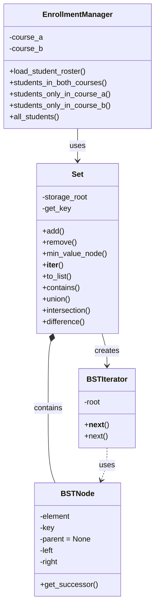

```mermaid
classDiagram
    class BSTNode {
        -element
        -key
        -parent = None
        -left
        -right
        +get_successor()
    }
    
    class BSTIterator {
        -root
        +__next__()
        +next()
    }
    
    class Set {
        -storage_root
        -get_key
        +add()
        +remove()
        +min_value_node()
        +__iter__()
        +to_list()
        +contains()
        +union()
        +intersection()
        +difference()
    }
    
    class EnrollmentManager {
        -course_a
        -course_b
        +load_student_roster()
        +students_in_both_courses()
        +students_only_in_course_a()
        +students_only_in_course_b()
        +all_students()
    }
    
    Set *-- BSTNode : contains
    BSTIterator ..> BSTNode : uses
    Set --> BSTIterator : creates
    EnrollmentManager --> Set : uses
```
