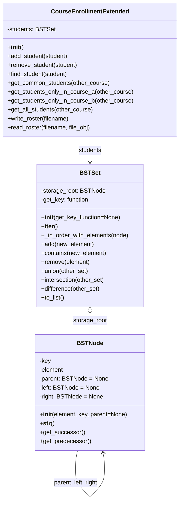
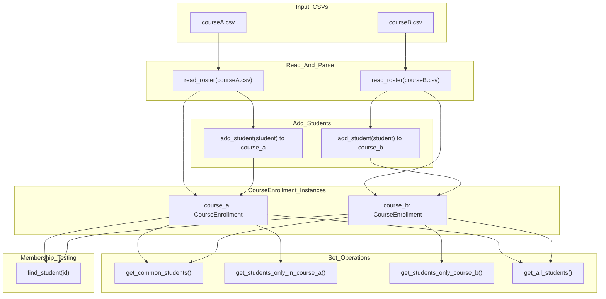

#Group Members: Michael Jung (ID:10680322), Timothy Sanders (ID: 01002147), Megan Ng (ID: 00756276)

#Date: 5/11/25

#Course: Spr25_CS_034 CRN 39575

## Part 1: UML/CRC

## Part 3: Data Flow Sketch
