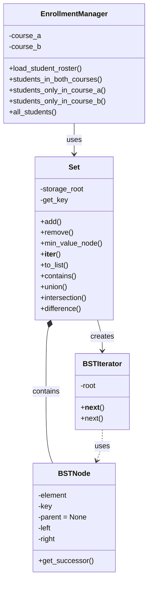

#Group Members: Michael Jung (ID:10680322), Timothy Sanders (ID: 01002147), Megan Ng (ID: 00756276)

#Date: 5/11/25

#Course: Spr25_CS_034 CRN 39575
#----------------------------------------------

🧩 Part 1: UML/CRC

🔷 BSTNode Class

Class:                     BSTNode
Fields:          element            key
Behaviors:       get_successor()

🔷 Set Class
Class: 
Set
Fields:
storage_root
get_key
Behaviors:
add()
remove()
_min_value_node()
__iter__()
_in_order_with_elements()
contains()
union()
intersection()
difference()
to_list()

🔷 EnrollmentManager Class
Class: 
EnrollmentManager
Fields:
course_a
course_b
Behaviors:
load_student_roster()
students_in_both_courses()
students_only_in_course_a()
students_only_in_course_b()
all_students()

